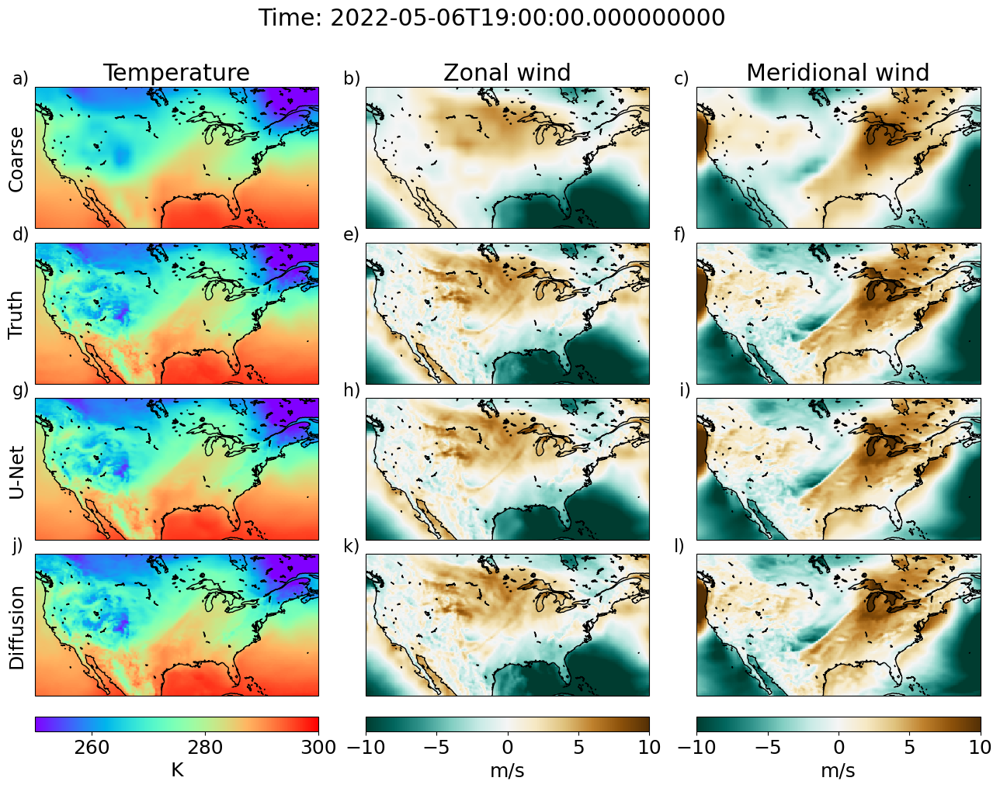

## Generative diffusion-based downscaling for climate
### Robbie A. Watt & Laura A. Mansfield

This repo contains code to go alongside Watt & Mansfield (2024) preprint. In this preprint, we apply a diffusion based model and a Unet to a downscaling problem with climate data. The diffusion model is based on the implementation by T. Karras et al. (<https://arxiv.org/abs/2206.00364>) and the code is addapted from <https://github.com/NVlabs/edm>.

## File structure
* src: contains code used to train model
* inference: contains inference and plotting scripts 
* Model_chpt: contains model checkpoints
* download_ERA5: contains scripts for downloading ERA5 data and processing into netcdf files.

## Usage
### Download ERA5 data
The script `download_ERA5/ERA5_download_my_dates_sfc.sh` downloads the variables (temperature at 2m and zonal and meridional winds at 100 hPa) for all years of ERA5 up to 2022 and saves files into a directory named `data/`. You may need to edit data directories. Note that we subsample in time to reduce the size of the dataset (see file `preprocessing_subsample.py`). Data is concatenated into yearly samples and saved as `samples_{year}.nc`. 

### Training
To train either the diffusion or unet models from scratch, simply run the `src/TrainDiffusion.py` or `src/TrainUnet.py` script from the project root directory.

### Inference
After training, the inference scripts can be run in the following order:
1. `save_test_truth.py`: this script simply processes the true test data to save it into one file for easier comparison to other variables
2. `save_test_preds.py`: this script runs through all test data and saves the output into one file. You need to run this for each model. `modelname=UNet` for the standard UNet, `modelname=LinearInterpolation` for linear interpolation of coarse resolution variables onto the high resolution grid (i.e., the inputs to the model) and `modelname=Diffusion` for the diffusion model. When running the Diffusion model, we generate many possible samples in a loop, each seeded with a different random number, currently we loop over `rngs=range(0, 30)`.

After running the above scripts, you should have files saved as `output/{modelname}/samples_2018-2023.nc` (or for diffusion, these are saved as `output/Diffusion/samples_{i}_2018-2023.nc` where `i` indexes the different generated samples).

Plotting scripts:
* `plot_timestep_examples.py` plots maps of methods for each timestep (used for Fig. 1).
* `plot_error_metrics.py` plots maps of error metrics across full test dataset (Fig. 2) and prints the mean across the domain.
* `plot_spectrum.py` plots the power spectrum for all methods (Fig. 3)

## Citation

